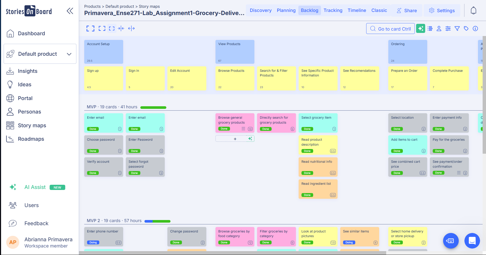
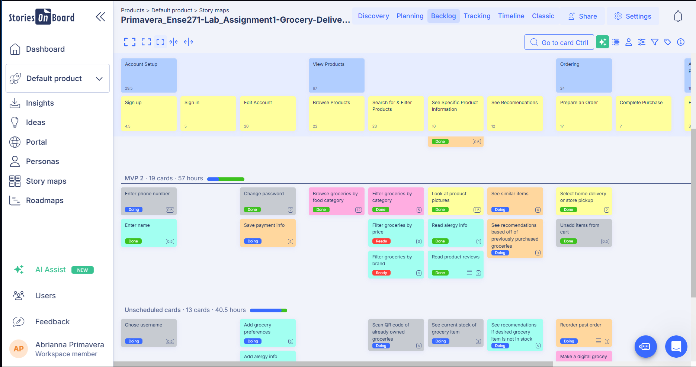
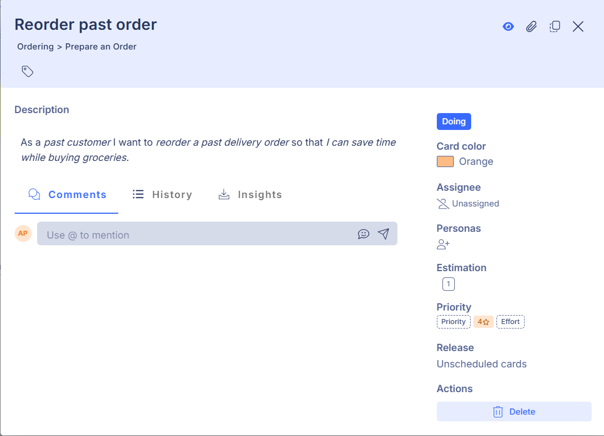
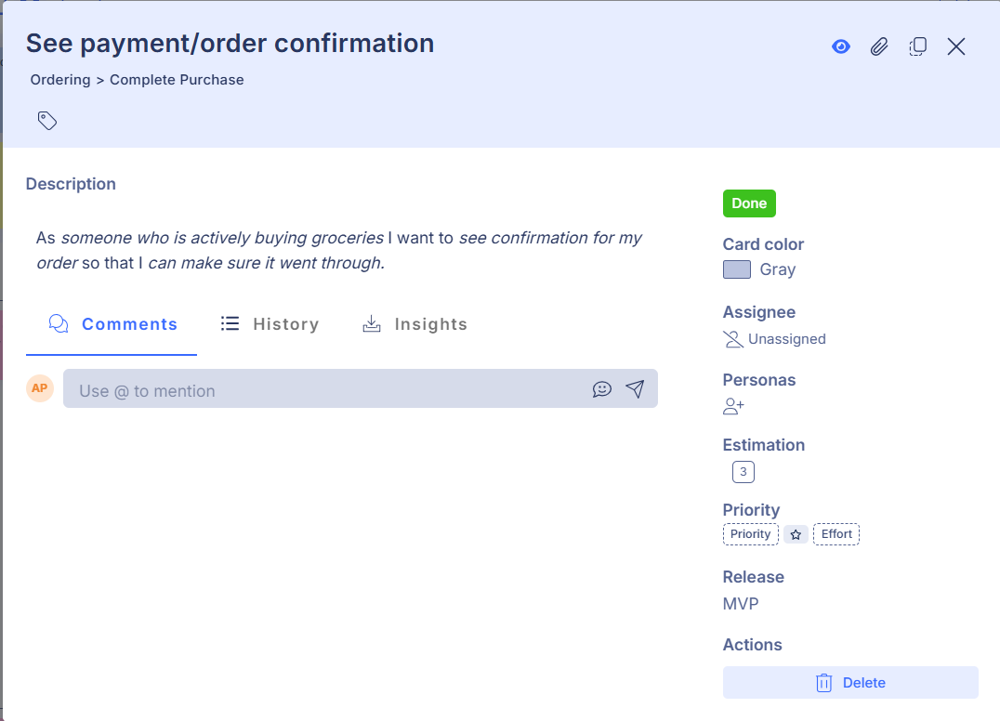
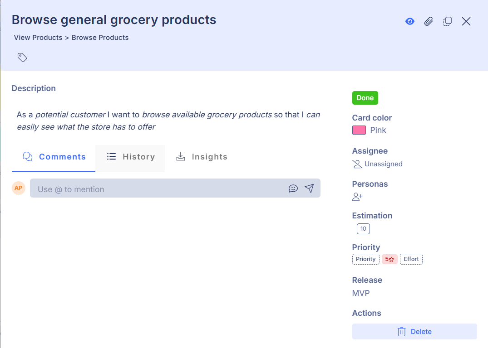
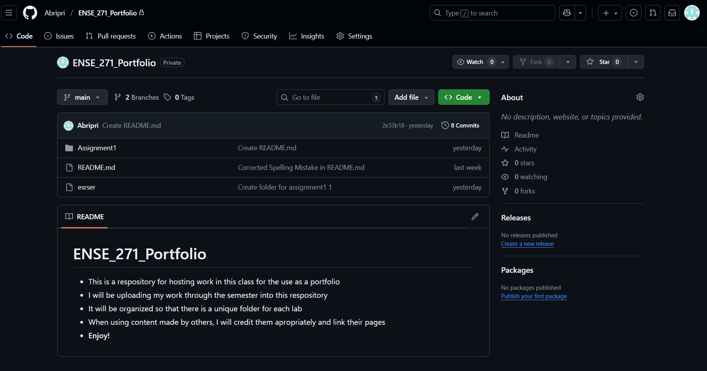

# Submission Overview

## Entire User Story Map

---

## Close-Up Images
### Right Most Side of MVP 1

### Left Most Side of MVP 1

### Right Most Side of MVP 2

### Right Most Side of the Unscheduled Cards

### Left Most Side of Both MVP 2 and the Unscheduled Cards

---
## Detailed Tasks

---

## Image of GitHub Repo

---
## Explanation

	Thought process for developing my user story map:	

	- When developing my user story map, I first thought about what kind of functions a grocery delivery app
 	  might have and about what might make the app more useful. These were all just randomly listed as tasks under blank 
	  steps. I then thought about the process a user would have to go though in order to purchase groceries using an app.
	  This process was originally mostly placed as epics, but were then changed down to the walking skeleton as steps. 
	  This was because they were mostly not broad enough to be used as the backbone. I then had to think about a way to 
	  categorize these steps. So, I created the epics "Account Setup", "Ordering, and "Track Order". The next part of my 
	  process was deciding where all the previously written tasks would go. After this, the tasks that did not fit nicely 
	  under any existing steps were put under a placeholder step. After this, I found that I had way too many tasks under 
	  the "View Products" step under "Ordering". So, I thought about moving it into its own epic and further decomposing it.
	  It made more sense that way, since a user could view the listed groceries without buying any. I then expanded the 
	  scope of the "Track Delivery" epic by renaming it "After Completing a Purchase", so that I could put the task of 
	  reviewing a product somewhere on the map. For the last important part of this map, I thought about which tasks would 
	  be preformed more often by the app's users and which would be most necessary.
	  
	
	Three decisions I made when creating the stories in map. Why I made those decisions. How the results of those decision
	are captured in the user story map:
	
	- First Decision: Including nutritional info & ingredient list within the stories	
		- I made the decision to include the product nutritional information and ingredient list because I think they 
		  are important to have and to be able to see even when ordering online. It can be nice to know what is in the 
		  food you are eating; people may need/want to track their food; people may need to avoid certain ingredients. 
		  The result of this decision is captured in the user story map by its inclusion as one of the stories/tasks.
	- Second Decision: Including product reviews as a story
		- The decision was made to include "review products" as a story/task because I think that it is useful to see 
		  what customers who have already bought a product think of said product. The result of this decision is captured 
		  in the user story map by its inclusion as one of the stories/tasks. The result of the decision is also captured 
		  by the creation of the step of the same title with an expanded review section.
	- Third Decision: Adding many ways to filter a search
		- All the different ways to filter a search were included within the stories because I think they are all 
		  incredibly useful. They can help you to better find the products that you are looking for. The result of
		  this decision is captured in the user story map by its inclusion as one of the stories/tasks.

	The extra features that I tried:
		- Business Value: I added a business value to all the tasks. A higher score meant that the function could 
		  potentially make thebusiness more money.
		- Colour: The tasks were given different colours to better indicate this business value, since you could 
		  not see it unless on the planning section of the website.
  		- This is what the colours mean: Pink = 5 stars (high), orange = 4 stars (moderate), yellow = 3 stars (low), 
		  teal = 2 stars (minor), gray = 1 star (zero)

---

